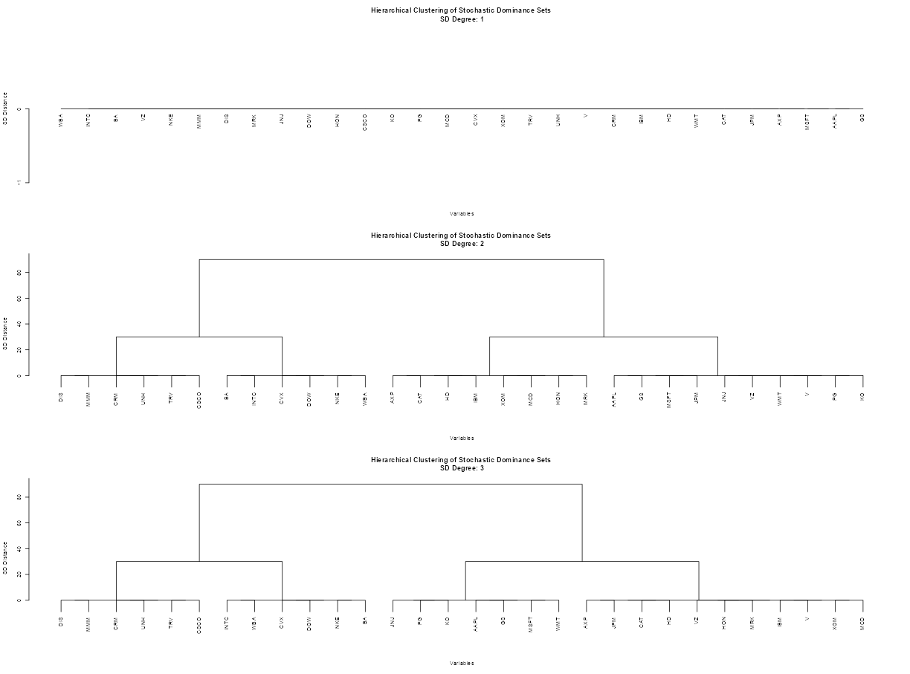
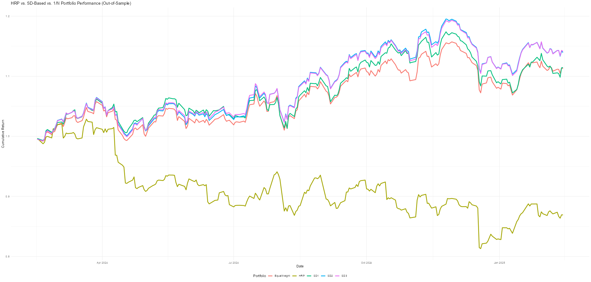

# **Using Stochastic Dominant Clusters vs. HRP and 1/N**

This analysis compares **Stochastic Dominance (SD) clustering**, **Hierarchical Risk Parity (HRP)**, and **Equal-Weighted (1/N)** portfolio allocations **out-of-sample**.  
The **`NNS.SD.cluster`** function (available in **NNS >= v11.1**) is used to retrieve **Stochastic Dominant Clusters (SD1, SD2, SD3)**.



The HRP method retains its original weighting scheme using a recursive bisection algorithm that leverages the covariance matrix, while our method in this example uses a naive equal weight both between and within the `NNS.SD` clusters.  We leave other, more motivated objective functions as an exercise for the reader...

```r
###############################################################################
# Load necessary libraries
###############################################################################
library(quantmod)
library(tidyverse)
library(cluster)
library(NNS)
library(PerformanceAnalytics)
library(factoextra)
library(rvest)
library(knitr)

###############################################################################
# 1. Fetch S&P 500 Stock List
###############################################################################
sp500_url <- "https://en.wikipedia.org/wiki/List_of_S%26P_500_companies"
sp500_table <- read_html(sp500_url) %>% html_table(fill = TRUE)
sp500_tickers <- sp500_table[[1]]$Symbol

# Clean tickers (remove periods, etc.)
sp500_tickers <- gsub("\\.", "-", sp500_tickers)

###############################################################################
# 2. Function to Fetch Stock Data with Missing Data Handling
###############################################################################
get_stock_data <- function(tickers, start_date = "2018-01-01", end_date = "2025-02-15") {
  stock_data <- map(tickers, function(ticker) {
    tryCatch({
      # Using only adjusted prices (6th column from Yahoo)
      data <- getSymbols(ticker, src = "yahoo", from = start_date, to = end_date, auto.assign = FALSE)[,6]
      if (nrow(data) < 500) return(NA)  # Ensure minimum # of data points
      return(data)
    }, error = function(e) NA)
  })
  
  # Remove tickers with entirely failed or NA results
  valid_indices <- which(!sapply(stock_data, function(x) is.null(x) || is.na(x)))
  stock_data <- stock_data[valid_indices]
  
  # Merge all data
  if (length(stock_data) == 0) {
    stop("No valid stock data retrieved. Check ticker list or data source.")
  }
  stock_data <- reduce(stock_data, merge)
  
  # Forward-fill & remove any residual NAs
  stock_data <- na.locf(stock_data)
  stock_data <- na.omit(stock_data)
  
  # Assign column names to final combined object
  colnames(stock_data) <- sp500_tickers[valid_indices]
  return(stock_data)
}

###############################################################################
# 3. Fetch Stock Price Data
###############################################################################
price_data <- get_stock_data(sp500_tickers)

###############################################################################
# 4. Compute Daily Returns and Train/Test Split
###############################################################################
returns <- ROC(price_data, type = "continuous")[-1,] %>% na.omit()
n_obs <- nrow(returns)
test_size <- 250  # last 250 for testing
train_returns <- returns[1:(n_obs - test_size), ]
test_returns <- returns[(n_obs - test_size + 1):n_obs, ]

###############################################################################
# 5. HRP Implementation (Standard)
###############################################################################
hrp_weights <- function(returns_df, linkage_method = "single") {
  # 1) Estimate correlation & covariance
  corr_mat <- cor(returns_df, use = "pairwise.complete.obs")
  cov_mat  <- cov(returns_df, use = "pairwise.complete.obs")
  
  # 2) Convert correlation into distance matrix
  dist_mat <- as.dist(sqrt((1 - corr_mat) / 2))
  
  # 3) Hierarchical clustering
  cluster_hc <- hclust(dist_mat, method = linkage_method)
  
  # 4) Quasi-Diagonal Sort (leaf ordering)
  get_quasi_diag <- function(hc, n_assets) {
    w <- rep(0, n_assets)
    w[hc$order] <- 1:n_assets
    hc$order
  }
  sort_ix <- get_quasi_diag(cluster_hc, ncol(returns_df))
  
  # 5) Recursive bisection
  cluster_variance <- function(cov_mat, cluster_indices) {
    sub_cov <- cov_mat[cluster_indices, cluster_indices, drop = FALSE]
    w_ <- rep(1 / length(cluster_indices), length(cluster_indices))
    as.numeric(t(w_) %*% sub_cov %*% w_)
  }
  
  get_weights <- function(cov_mat, sorted_indices) {
    n_sub <- length(sorted_indices)
    if (n_sub == 1) return(1)
    split <- floor(n_sub / 2)
    left_idx  <- sorted_indices[1:split]
    right_idx <- sorted_indices[(split + 1):n_sub]
    var_left  <- cluster_variance(cov_mat, left_idx)
    var_right <- cluster_variance(cov_mat, right_idx)
    alpha <- 1 - var_left / (var_left + var_right)
    w_left  <- get_weights(cov_mat, left_idx)  * alpha
    w_right <- get_weights(cov_mat, right_idx) * (1 - alpha)
    c(w_left, w_right)
  }
  
  final_w <- get_weights(cov_mat, sort_ix)
  final_w <- final_w / sum(final_w)
  
  # Map sorted weights back to original columns
  asset_names <- colnames(returns_df)
  out_weights <- rep(NA, length(final_w))
  for (i in seq_along(final_w)) {
    out_weights[sort_ix[i]] <- final_w[i]
  }
  names(out_weights) <- asset_names
  out_weights
}

###############################################################################
# 6. SD-Based Clustering with Preserved Clusters (Equal Weighting):
#    Here we allocate equal weight across clusters and equal weight within each cluster.
###############################################################################
sd_hrp_cluster_weights_equal <- function(returns_df, degree_val = 1, type = "discrete", min_cluster = 5) {
  # Run SD clustering and get the clusters.
  sd_clust_result <- NNS.SD.cluster(returns_df, 
                                    degree = degree_val, 
                                    type = type, 
                                    min_cluster = min_cluster, 
                                    dendrogram = FALSE)
  
  # Check if we got clusters in the expected element "Clusters"
  if (is.null(sd_clust_result$Clusters)) {
    message("Available names in the SD clustering result:")
    print(names(sd_clust_result))
    stop("No cluster assignments available (possibly not enough assets or no valid SD sets).")
  }
  
  # Convert the list of clusters into a named vector:
  # Each asset will be assigned the name of the cluster it belongs to.
  clusters_list <- sd_clust_result$Clusters  # A list where each element contains asset names
  clusters <- unlist(lapply(seq_along(clusters_list), function(i) {
    rep(paste0("Cluster_", i), length(clusters_list[[i]]))
  }))
  names(clusters) <- unlist(clusters_list)
  
  asset_names <- colnames(returns_df)
  
  # Step 1: Equal weight allocation across clusters
  unique_clusters <- unique(clusters)
  n_clusters <- length(unique_clusters)
  cluster_weights <- rep(1/n_clusters, n_clusters)
  names(cluster_weights) <- unique_clusters
  
  # Step 2: Within-cluster allocation using equal weights
  asset_weights <- rep(NA, ncol(returns_df))
  names(asset_weights) <- asset_names
  
  for (cl in unique_clusters) {
    assets_in_cluster <- names(clusters)[clusters == cl]
    # Each asset in the cluster gets equal weight within that cluster
    within_cluster_weights <- rep(1/length(assets_in_cluster), length(assets_in_cluster))
    # Multiply by the cluster's weight to get the overall asset weight
    asset_weights[assets_in_cluster] <- within_cluster_weights * cluster_weights[cl]
  }
  
  asset_weights
}

###############################################################################
# 7. Compute Weights:
#    - HRP using standard hierarchical clustering
#    - SD-based clustering preserving clusters for degrees 1, 2, 3
###############################################################################
train_cov_matrix <- cov(train_returns, use="pairwise.complete.obs")

# HRP weights (standard)
hrp_weights_vec <- hrp_weights(train_returns)

# SD-based weights for degrees 1, 2, 3 (using cluster-preserving allocation)
K = 5
sd1_weights <- sd_hrp_cluster_weights_equal(train_returns, degree_val = 1, min_cluster = K)
sd2_weights <- sd_hrp_cluster_weights_equal(train_returns, degree_val = 2, min_cluster = K)
sd3_weights <- sd_hrp_cluster_weights_equal(train_returns, degree_val = 3, min_cluster = K)

# Normalize them just in case
hrp_allocations <- hrp_weights_vec / sum(hrp_weights_vec)
sd1_allocations <- sd1_weights    / sum(sd1_weights)
sd2_allocations <- sd2_weights    / sum(sd2_weights)
sd3_allocations <- sd3_weights    / sum(sd3_weights)

###############################################################################
# 8. Out-of-Sample Performance Comparison
###############################################################################
# Simple function for performance metrics
performance_metrics <- function(ret_vec) {
  # ret_vec is a numeric vector of daily returns
  ann_ret <- (prod(1 + ret_vec)^(252/length(ret_vec))) - 1
  ann_sd  <- sd(ret_vec)*sqrt(252)
  sharpe  <- ifelse(ann_sd == 0, NA, ann_ret/ann_sd)
  c("Annual_Return"=ann_ret, 
    "Annual_Stdev" =ann_sd, 
    "Sharpe_Ratio" =sharpe)
}

# 1/N equal weight to compare
equal_allocations <- rep(1/ncol(test_returns), ncol(test_returns))
names(equal_allocations) <- colnames(test_returns)

# Compute daily portfolio returns in test set
test_hrp_returns   <- rowSums(test_returns * hrp_allocations, na.rm = TRUE)
test_sd1_returns   <- rowSums(test_returns * sd1_allocations, na.rm = TRUE)
test_sd2_returns   <- rowSums(test_returns * sd2_allocations, na.rm = TRUE)
test_sd3_returns   <- rowSums(test_returns * sd3_allocations, na.rm = TRUE)
test_equal_returns <- rowSums(test_returns * equal_allocations, na.rm = TRUE)


# Summarize performance into a data frame
perf_df <- data.frame(
  Portfolio = c("HRP", "SD1", "SD2", "SD3", "1/N"),
  rbind(
    performance_metrics(test_hrp_returns),
    performance_metrics(test_sd1_returns),
    performance_metrics(test_sd2_returns),
    performance_metrics(test_sd3_returns),
    performance_metrics(test_equal_returns)
  )
)

# Print a formatted table
kable(perf_df, caption = "Portfolio Performance Metrics", digits = 4)
```
```r
Table: Portfolio Performance Metrics

|Portfolio | Annual_Return| Annual_Stdev| Sharpe_Ratio|
|:---------|-------------:|------------:|------------:|
|HRP       |        0.1208|       0.1160|       1.0422|
|SD1       |        0.1306|       0.1149|       1.1372|
|SD2       |        0.1564|       0.1135|       1.3773|
|SD3       |        0.1542|       0.1139|       1.3548|
|1/N       |        0.1135|       0.1143|       0.9925|
```
```r
###############################################################################
# 9. Plot Cumulative Returns
###############################################################################
cumulative_returns <- data.frame(
  Date = index(test_returns),
  HRP = cumprod(1 + test_hrp_returns),
  SD1 = cumprod(1 + test_sd1_returns),
  SD2 = cumprod(1 + test_sd2_returns),
  SD3 = cumprod(1 + test_sd3_returns),
  EqualWeight = cumprod(1 + test_equal_returns)
) %>% tidyr::gather(key = "Portfolio", value = "CumulativeReturn", -Date)

ggplot(cumulative_returns, aes(x = Date, y = CumulativeReturn, color = Portfolio)) +
  geom_line(size = 1.2) +
  theme_minimal() +
  ggtitle("HRP vs. SD-Based (Clusters Preserved) vs. 1/N Portfolio Performance (Out-of-Sample)") +
  ylab("Cumulative Return") +
  xlab("Date") +
  theme(legend.position = "bottom")
```


