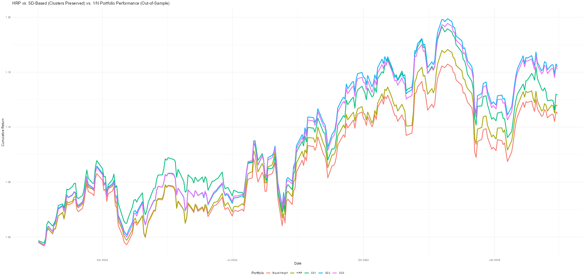

# Using Stochastic Dominant Clusters vs. HRP and 1/N
```r
# Load necessary libraries
library(quantmod)
library(tidyverse)
library(cluster)
library(NNS)
library(PerformanceAnalytics)
library(factoextra)
library(rvest)

# Step 1: Fetch S&P 500 Stock List
sp500_url <- "https://en.wikipedia.org/wiki/List_of_S%26P_500_companies"
sp500_table <- read_html(sp500_url) %>% html_table(fill = TRUE)
sp500_tickers <- sp500_table[[1]]$Symbol

# Remove tickers with special characters (e.g., BRK.B → BRK-B)
sp500_tickers <- gsub("\\.", "-", sp500_tickers)


# Function to fetch stock data and handle missing values
get_stock_data <- function(tickers, start_date = "2018-01-01", end_date = Sys.Date()) {
  stock_data <- map(tickers, function(ticker) {
    tryCatch({
      data <- getSymbols(ticker, src = "yahoo", from = start_date, to = end_date, auto.assign = FALSE)[,6]
      if (nrow(data) < 500) return(NA)  # Ensure enough data points
      return(data)
    }, error = function(e) NA)
  })
  
  # Remove tickers with excessive missing values
  valid_indices <- which(!sapply(stock_data, is.null) & !sapply(stock_data, function(x) any(is.na(x))))
  stock_data <- stock_data[valid_indices]
  
  # Merge and handle missing values
  stock_data <- reduce(stock_data, merge)
  stock_data <- na.locf(stock_data)  # Forward-fill missing values
  stock_data <- na.omit(stock_data)  # Remove any remaining NAs
  colnames(stock_data) <- sp500_tickers[valid_indices]
  return(stock_data)
}

# Fetch stock price data
price_data <- get_stock_data(sp500_tickers)

# Compute daily returns
returns <- ROC(price_data, type = "continuous")[-1,] %>% na.omit()

# Step 2: Train-Test Split (Last 250 Observations for Testing)
train_returns <- returns[1:(nrow(returns) - 250), ]
test_returns <- returns[(nrow(returns) - 249):nrow(returns), ]

# Compute covariance matrix on training data
train_cov_matrix <- cov(train_returns)

# Function to compute inverse variance weights within each cluster
inverse_variance_weights_by_cluster <- function(ret_mat, cluster_assignments) {
  weights <- rep(0, ncol(ret_mat))
  
  for (cluster in unique(cluster_assignments)) {
    idx <- which(cluster_assignments == cluster)  # Assets in the cluster
    cluster_cov <- cov(ret_mat[, idx])  # Covariance matrix for the cluster
    
    variances <- diag(cluster_cov)  # Extract variances
    inv_variances <- 1 / variances  # Compute inverse variances
    cluster_weights <- inv_variances / sum(inv_variances)  # Normalize within the cluster
    
    # Assign weights back to the main weight vector
    weights[idx] <- cluster_weights / length(unique(cluster_assignments))  # Normalize across clusters
  }
  
  return(weights)
}

# Compute SD-based clusters (independent cluster assignment for each SD method)
sd_clustering <- function(ret_mat, degree = 1, k = 5) {
  clusters <- NNS.SD.cluster(ret_mat, degree = degree, min_cluster = k)$Clusters
  cluster_assignments <- rep(NA, ncol(ret_mat))
  for (i in seq_along(clusters)) {
    cluster_assignments[which(colnames(ret_mat) %in% clusters[[i]])] <- i
  }
  return(cluster_assignments)
}

K = 5

sd1_clusters <- sd_clustering(train_returns, degree = 1, k = K)
sd2_clusters <- sd_clustering(train_returns, degree = 2, k = K)
sd3_clusters <- sd_clustering(train_returns, degree = 3, k = K)

# Apply cluster-based inverse variance weighting for each method
sd1_weights <- inverse_variance_weights_by_cluster(train_returns, sd1_clusters)
sd2_weights <- inverse_variance_weights_by_cluster(train_returns, sd2_clusters)
sd3_weights <- inverse_variance_weights_by_cluster(train_returns, sd3_clusters)

# HRP: Apply hierarchical clustering first
hrp_clusters <- cutree(hclust(dist(train_cov_matrix)), k = 5)  # Hierarchical clustering
hrp_allocations <- inverse_variance_weights_by_cluster(train_returns, hrp_clusters)

# Compute 1/N Equal-Weighted Portfolio Weights
equal_weights <- rep(1 / ncol(train_returns), ncol(train_returns))

# Apply trained weights to out-of-sample test data
test_hrp_returns <- rowSums(test_returns * hrp_allocations, na.rm = TRUE)
test_sd1_returns <- rowSums(test_returns * sd1_weights, na.rm = TRUE)
test_sd2_returns <- rowSums(test_returns * sd2_weights, na.rm = TRUE)
test_sd3_returns <- rowSums(test_returns * sd3_weights, na.rm = TRUE)
test_equal_returns <- rowSums(test_returns * equal_weights, na.rm = TRUE)

# Compute performance metrics
performance_metrics <- function(portfolio_returns) {
  mean_return <- mean(portfolio_returns)
  volatility <- sd(portfolio_returns)
  sharpe_ratio <- mean_return / volatility
  sortino_ratio <- mean_return / sd(portfolio_returns[portfolio_returns < 0])
  var_95 <- quantile(portfolio_returns, 0.05)
  cvar_95 <- mean(portfolio_returns[portfolio_returns <= var_95])
  
  return(data.frame(
    Mean_Return = mean_return,
    Volatility = volatility,
    Sharpe_Ratio = sharpe_ratio,
    Sortino_Ratio = sortino_ratio,
    VaR_95 = var_95,
    CVaR_95 = cvar_95
  ))
}

# Print performance metrics for out-of-sample test period
perf_df <- rbind(
  cbind("Portfolio" = "HRP", performance_metrics(test_hrp_returns)),
  cbind("Portfolio" = "SD1", performance_metrics(test_sd1_returns)),
  cbind("Portfolio" = "SD2", performance_metrics(test_sd2_returns)),
  cbind("Portfolio" = "SD3", performance_metrics(test_sd3_returns)),
  cbind("Portfolio" = "Equal Weight (1/N)", performance_metrics(test_equal_returns))
)

print(perf_df)
```
```r
          Portfolio   Mean_Return  Volatility Sharpe_Ratio Sortino_Ratio      VaR_95     CVaR_95
                HRP -0.0005004942 0.010913501  -0.04586009   -0.04456755 -0.01679933 -0.03306416
                SD1  0.0004607076 0.007312199   0.06300535    0.09714240 -0.01219120 -0.01542600
                SD2  0.0005486318 0.007184193   0.07636653    0.12067523 -0.01133229 -0.01511544
                SD3  0.0005550809 0.007207268   0.07701682    0.12066801 -0.01171807 -0.01531103
 Equal Weight (1/N)  0.0004524134 0.007200696   0.06282913    0.09186082 -0.01164580 -0.01641287
```

```r
# Generate out-of-sample cumulative return plot
cumulative_returns <- data.frame(
  Date = index(test_returns),
  HRP = cumprod(1 + test_hrp_returns),
  SD1 = cumprod(1 + test_sd1_returns),
  SD2 = cumprod(1 + test_sd2_returns),
  SD3 = cumprod(1 + test_sd3_returns),
  EqualWeight = cumprod(1 + test_equal_returns)
) %>% gather(key = "Portfolio", value = "Cumulative Return", -Date)

ggplot(cumulative_returns, aes(x = Date, y = `Cumulative Return`, color = Portfolio)) +
  geom_line(size = 1.2) +
  theme_minimal() +
  ggtitle("HRP vs. SD-Based vs. 1/N Portfolio Performance (Out-of-Sample)") +
  ylab("Cumulative Return") +
  xlab("Date") +
  theme(legend.position = "bottom")
```


