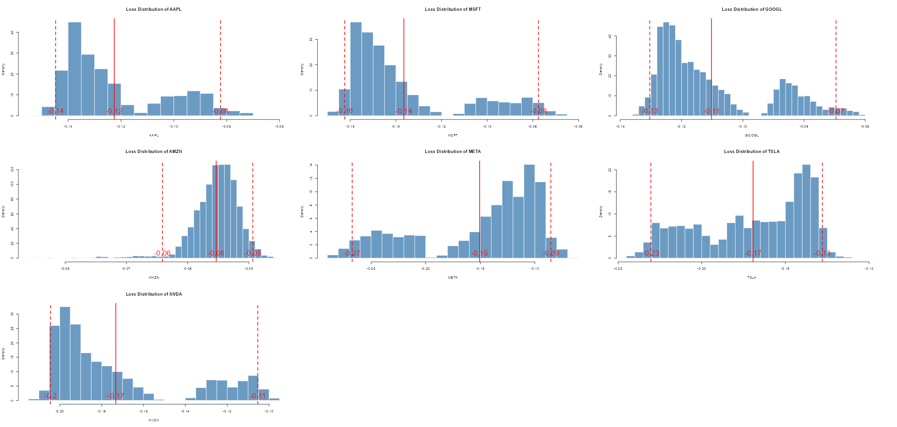

# Stress Testing 
Overview of stress testing procedure whereby analysis is restricted to the CLPM quadrant of returns and `NNS.reg()` is utilized to uphold multivariate dependence structure.

## Data
Assuming you have historical returns for securities of interest
```r
> head(Returns)
                    SPY          AAPL          MSFT         GOOGL          AMZN         META         TSLA         NVDA
2019-12-27 -0.000247777 -0.0003794828  0.0018277466 -0.0057468387  0.0005511477  0.001491953 -0.001299523 -0.009699417
2019-12-30 -0.005513222  0.0059351321 -0.0086185853 -0.0110214627 -0.0122526496 -0.017731871 -0.036432872 -0.019208845
2019-12-31  0.002429297  0.0073065483  0.0006980177 -0.0002388404  0.0005143848  0.004109370  0.008753267  0.012827149
2020-01-02  0.009351923  0.0228163199  0.0185161587  0.0218681710  0.0271506104  0.022070640  0.028518175  0.019591947
2020-01-03 -0.007572233 -0.0097220355 -0.0124517498 -0.0052313429 -0.0121390347 -0.005291260  0.029633258 -0.016005956
```

## Procedure
```r
library(NNS)

target <- 0  # 1 if using geometric returns
desired_output <- -0.1  # 10% drop in SPY
tolerance <- 0.01 # Tolerance for desired output
nn <- 1e6  # Number of random samples

# Create a subset where all variables in the data frame are below 0
clpm_observations <- Returns[apply(Returns, 1, function(row) all(row < target)), ]
qq <- nrow(clpm_observations)

original_regressors <- clpm_observations[, -1]

# Target variable
y <- clpm_observations[, 1]

# Generate bootstrapped replicates of each regressor
sampled_regressors <- apply(original_regressors, 2, function(i) 
  tail(as.vector(NNS::NNS.meboot(as.vector(i), reps = ceiling(nn/qq), rho = 1, type = "pearson")["replicates",]$replicates), nn))
```
### Correlation and Dependence
Verify we have similar pairwise correlation structures between our `original_regressors` and our significantly expanded `sampled_regressors`.
```r
> dim(original_regressors)
[1] 181   7

> dim(sampled_regressors)
[1] 1000000       7

> cor(original_regressors)
           AAPL      MSFT     GOOGL      AMZN      META      TSLA      NVDA
AAPL  1.0000000 0.7972463 0.7472231 0.4848196 0.4313900 0.5535680 0.6560521
MSFT  0.7972463 1.0000000 0.7740774 0.5743997 0.5174971 0.5375393 0.6823639
GOOGL 0.7472231 0.7740774 1.0000000 0.5247796 0.5337422 0.4672467 0.6527023
AMZN  0.4848196 0.5743997 0.5247796 1.0000000 0.4965834 0.3756535 0.5108100
META  0.4313900 0.5174971 0.5337422 0.4965834 1.0000000 0.2550942 0.4752387
TSLA  0.5535680 0.5375393 0.4672467 0.3756535 0.2550942 1.0000000 0.5120716
NVDA  0.6560521 0.6823639 0.6527023 0.5108100 0.4752387 0.5120716 1.0000000

> cor(sampled_regressors)
           AAPL      MSFT     GOOGL      AMZN      META      TSLA      NVDA
AAPL  1.0000000 0.7484552 0.7154815 0.4904016 0.4543356 0.5225438 0.6107270
MSFT  0.7484552 1.0000000 0.7326160 0.5917882 0.5203096 0.4987540 0.6218768
GOOGL 0.7154815 0.7326160 1.0000000 0.5399825 0.5544882 0.4435353 0.6107863
AMZN  0.4904016 0.5917882 0.5399825 1.0000000 0.5213193 0.3924397 0.5179636
META  0.4543356 0.5203096 0.5544882 0.5213193 1.0000000 0.2702650 0.4829542
TSLA  0.5225438 0.4987540 0.4435353 0.3924397 0.2702650 1.0000000 0.4759697
NVDA  0.6107270 0.6218768 0.6107863 0.5179636 0.4829542 0.4759697 1.0000000
```
and via the `NNS.copula()` function which measures multivariate dependence.
```r
> NNS::NNS.copula(original_regressors)
[1] 0.7518493

> NNS::NNS.copula(sampled_regressors)
[1] 0.747049
```

## Regress, Predict and Filter
```r
# Optimal Clusters and predicted values
predicted_values <- NNS::NNS.stack(IVs.train = original_regressors,
                                   DV.train = y, 
                                   IVs.test = sampled_regressors,
                                   method = 1)$stack

# Find the closest match to the desired output
differences <- abs(predicted_values - desired_output)
best_index <- which.min(differences)

# Optimal regressors and achieved output
optimal_regressors <- sampled_regressors[best_index, ]
optimal_output <- predicted_values[best_index]

# Identify regressors within the tolerance range
within_tolerance <- differences <= tolerance
filtered_regressors <- as.data.frame(sampled_regressors[within_tolerance, ])

# Average value for filtered regressors
expected_regressors <- apply(filtered_regressors, 2, mean)
num_regressors <- ncol(filtered_regressors)

# Plot histograms for each regressor
par(mfrow = c(ceiling(sqrt(num_regressors)), ceiling(sqrt(num_regressors))))  # Arrange plots in a grid

for (i in 1:num_regressors) {
  regressor_name <- colnames(filtered_regressors)[i]
  
  variable <- filtered_regressors[[regressor_name]]
  
  hist(variable, breaks = 30, col = adjustcolor("steelblue", alpha.f = 0.8),
       border = "white", main = paste("Loss Distribution of", regressor_name), 
       xlab = regressor_name, freq = FALSE)
  
  var_mean <- mean(variable)
  
  # Confidence Intervals
  lpm_var <- NNS::LPM.VaR(percentile = 0.025, degree = 0, x = variable)
  upm_var <- NNS::UPM.VaR(percentile = 0.025, degree = 0, x = variable)
  
  abline(v = var_mean, col = "red", lwd = 2)  # Mean
  abline(v = upm_var, col = "red", lwd = 2, lty = 2)  # UPM.VaR
  abline(v = lpm_var, col = "red", lwd = 2, lty = 2)  # LPM.VaR
  
  text(x = c(var_mean, lpm_var, upm_var), 
       y = 0, 
       labels = round(c(var_mean, lpm_var, upm_var), 2), 
       col = "red", pos = 3, cex = 2)
}

par(mfrow = c(1, 1))  # Reset plotting layout
```
## Results
We have generated distributions of losses for each of the securities for this market loss scenario.
```r
> expected_regressors
       AAPL        MSFT       GOOGL        AMZN        META        TSLA        NVDA 
-0.12247582 -0.13683440 -0.11018115 -0.05534461 -0.15086033 -0.16917440 -0.17284660 
```



